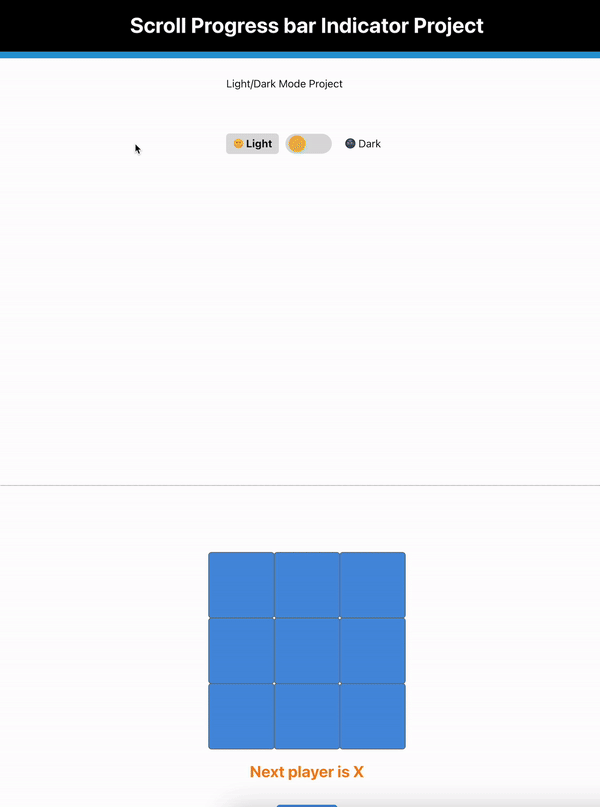

# Feature-Flags-Project

When you want to have centralised option to turn on or off a component or option for user so instead of re-build the code from scratch and re-deploy it you can have feature flag to enable or disable this component
let’s say for example you have a coming events like special sale or Christmas sale or want to enable a Christmas banner component where discount should be applied on certain categories of products so you just make an API call to that feature flag to turn that Christmas discount component on so it’s sort of configuration you build and then it’s easy to use 
another example you want to allow a feature to work on certain users depend on anything like a location for example so it’s sort of conditional feature applies on what you allow and be disabled on what you choose
 so we can say that feature flag is a tool that allow you to enable or disable a feature without modifying the source code or performing a new deployment
Other names for Feature Flags are Feature Toggles, Release Toggles, Feature Flippers, and Remote Configurations.

we use in this project React Context as our State Management

let’s say we have these components and we want to enable/disable them so enable means display them and disable means hide them from the page
Popup Modal Component 
Dark Light Mode Component
Scroll Progress bar Indicator Component
Search AutoComplete Component
Star Rating Component
Accordion Multi Selection Component
Tic Tac Toe Game Component

Inside Components folder create folder for FeatureFlags and inside this create folder named context and inside context create FeatureFlagGlobalState.jsx 

featureFlagsDataServiceCall.js
in here we need to config the components as key and value
so this will be the key value pairs you will be receiving from the API with a function to config this service
export const featureFlagsDataServiceCall = () => {
    return new Promise((resolve) => {
      setTimeout(() => {
        resolve({
          showDarkLightMode: true,
          showTicTacToeBoard: true,
          showAccordion: true,
          showPopupModal: true,
          showScrollProgress: true,
          showSearchAutoComplete: true,
          showStarRating: true,
        });
      }, 1000);
    });
  };
  
now let’s create our Context / FeatureFlagGlobalState.jsx

import React, { createContext, useState, useEffect } from "react";
import { featureFlagsDataServiceCall } from "../featureFlagsDataServiceCall";

export const FeatureFlagsContext = createContext();

export const FeatureFlagsProvider = ({ children }) => {
  const [loading, setLoading] = useState(true);
  const [enabledFlags, setEnabledFlags] = useState({});

  useEffect(() => {
    featureFlagsDataServiceCall().then((flags) => {
      setEnabledFlags(flags);
      setLoading(false);
    });
  }, []);

  return (
    <FeatureFlagsContext.Provider value={{ loading, enabledFlags }}>
      {children}
    </FeatureFlagsContext.Provider>
  );
};

now FeatureFlags.jsx

import React, { useContext } from "react";
import { FeatureFlagsContext } from "./context/FeatureFlagGlobalState";
import Accordion from "../accordion/src/components/accordion/index";
import DarkModeToggle from "../darkmode-toggle/src/components/index";
import TicTacTeo from "../tic-tac-teo/src/components/index";
import ModalP from "../popup-modal/src/components/modalP";
import StarRating from "../star-rating/src/components/index";
import SeachAutoComplete from "../search-autocomplete/src/components/SearchAutoComplete";
import ScrollProgressBarIndicator from "../scroll-progress-bar-indicator/src/components/index";

export default function FeatureFlags() {
  const { loading, enabledFlags } = useContext(FeatureFlagsContext);

  const componentsToRender = [
    { key: "showDarkLightMode", component: <DarkModeToggle /> },
    { key: "showTicTacToeBoard", component: <TicTacTeo /> },
    { key: "showAccordion", component: <Accordion /> },
    { key: "showPopupModal", component: <ModalP /> },
    { key: "showScrollProgress", component: <ScrollProgressBarIndicator /> },
    { key: "showSearchAutoComplete", component: <SeachAutoComplete /> },
    { key: "showStarRating", component: <StarRating noOfStars={5} /> },
  ];

  function checkEnabledFlags(key) {
    return enabledFlags[key];
  }

  if (loading) return <h1>Loading...</h1>;

  return (

  

    <h1>Feature Flags</h1>
    

      {componentsToRender.map((item) =>
        checkEnabledFlags(item.key) ? (
          
{item.component}

        ) : null
      )}
    

  

 );
}

you can re arrange components in order by switching lines order in here const componentsToRender = [

so now in our main component App.js
import React from "react";
import FeatureFlags from "./components/FeatureFlags/FeatureFlags";

function App() {
  return (
    

      <FeatureFlags />
    

  );
}

export default App;

index.js
import React from "react";
import ReactDOM from "react-dom/client";
import "./index.css";
import App from "./App";
import reportWebVitals from "./reportWebVitals";
import { FeatureFlagsProvider } from "./components/FeatureFlags/context/FeatureFlagGlobalState";

const root = ReactDOM.createRoot(document.getElementById("root"));
root.render(
  <React.StrictMode>
    <FeatureFlagsProvider>
      <App />
    </FeatureFlagsProvider>
  </React.StrictMode>
);

reportWebVitals();

with that you can easily switch components On or Off means display or hide components based on true or false value from here

featureFlagsDataServiceCall.js
in here we need to config the components as key and value
so this will be the key value pairs you will be receiving from the API with a function to config this service
export const featureFlagsDataServiceCall = () => {
    return new Promise((resolve) => {
      setTimeout(() => {
        resolve({
          showDarkLightMode: true,
          showTicTacToeBoard: true,
          showAccordion: true,
          showPopupModal: true,
          showScrollProgress: true,
          showSearchAutoComplete: true,
          showStarRating: true,
        });
      }, 1000);
    });
  }; 

